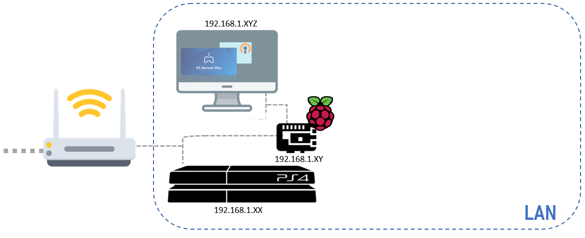

# PS4 and PS5: Improving your PS remote play experience:
## Introduction
This guide will allow you to improve your experience of PS remote play, reduce the load of Sony's servers and tap into the world of raspberry pi while sitting on your couch and playing your PS4 or 5 from anywhere. Hooked already? Well, here's how to do it:
As I wasn't able to find online the full explanation on how to solve this problem. My brother and I decided to note down the steps that allowed us to completely tackle some issues with the PS remote play.
PlayStation gives an amazing feature to all its users by enabling them to [play on their PlayStation from afar](https://remoteplay.dl.playstation.net/remoteplay/lang/en/index.html). My brother and I discovered this functionality during the quarantines in Europe for the Coronavirus. Thanks to it we were able to both play the PlayStation (not at the same time of course) while being physically separated. 
To put it simple the feature allows you to stream your ps4 on any device, your computer for instance. As this is streaming, you don't need huge specs on the client devices ([here are the ones for windows](https://remoteplay.dl.playstation.net/remoteplay/lang/gb/ps4_win.html) as an example), just a solid connection (15 Mb/s according to Sony's website). You can test your speed by making a speed test.
Although this tool is incredible and useful, it has a few drawbacks:
When playing remotely locally (i.e., on the same network):
* There are no connectivity issues and it works very well, capped at 720p and 30fps per second for a regular ps4 and, 1080p and 60fps for a PS4 pro and PS5
The problems arise when playing on a remote network:
* It requires a very high-speed internet on both sides
* Even if there are high-speed networks, you are dependent on the Sony server that allows you to communicate to the PlayStation.
* Sony's servers are a limited resource, the more users for remote play, the lesser the quality will be.
To give you an idea: although having very high speed on both sides, we were only able to run the PS4 remotely at 540p (which is sad really since most of PS4 games are made for 1080p) and 30fps.
Trying to go as high as 720p remotely was constantly disconnecting (potentially due to Sony's servers saturating).
<p align="center">
 
</p>
Using our solution, we were able to make the remote play running at 720p all the time from afar without any connectivity issues with a safe encrypted connection. It requires to buy some equipment but it is not very expensive and we found for you the cheapest one.
# Explanation of the solution:
Some of you might have guessed it from the beginning our goal here is to make the remote play locally even if you are located on another network, to bypass Sony's server (which they should be thankful as it reduces their load ;) ) and to connect your computer almost directly to the PS4 or 5.
To achieve so we have to connect securely the device you are streaming on to the network of the PlayStation, and we will achieve this building a VPN server here is a drawing explaining the principle of the solution.
<p align="center">
 
</p>

We will offer you 2 solutions depending on your usage: 
* A quick and dirty one that is very easy but that has some disadvantages (touchpad not working... for now), you only have this solution if the remote PC is running on Linux.
* A more complex one that enables you to have the full experience of the PlayStation remote play but that is a bit trickier to set up.

## Equipment needed:
Of course you will need some extra devices, setting a VPN server requires a machine to run full time but we have one that is consuming the equivalent of a lamp, and some cables if you don't already have them.
You will need:
* An internet router with a solid connection (15 Mb/s according to Sony's website)
* A fully operational [raspberry pi 4](https://www.raspberrypi.org/products/raspberry-pi-4-model-b/?resellerType=home)(4 Gb of RAM is enough, 2Gb of RAM might be as well), with its power supply and an SD card of 16Gb with the Raspberry Pi OS on it.
If you don't feel like burning the OS yourself on the SD card, you can buy SD cards with the OS preinstalled as described [here](https://www.raspberrypi.org/downloads/noobs/), no judgment here.
* A keyboard and a mouse (only for the installation not the usage)
* An ethernet cable to link the Raspberry to your router
* A second ethernet cable (if you don't already have it) to wire your PlayStation to the router as well.
* A PC for configuring the raspberry and testing the VPN (a PC on a remote network and a PC on the local network is the best configuration but one PC is fine)
#First steps that are common to all the solutions
* [Get you raspberry pi up and running with the Raspberry pi OS](https://magpi.raspberrypi.org/articles/set-up-raspberry-pi-4) you can find a lot of tutorials on the web for this and I will not be covering this here. 
* Connect your raspberry pi to the same router as the PlayStation and turn it on, in order for it to get a local ip address.
* On the raspberry get the local IP by typing `hostname -I` note it, it will be referred afterward as **raspberry IP**
* If your password on the raspberry is the default one, it's time for you to change it: `passwd` default one is 'raspberry'
* [Enable SSH on your raspberry](https://www.raspberrypi.org/documentation/remote-access/ssh/) for being able to connect to it from your computer and run commands on it.
* From your computer (on the local network) ssh onto the raspberry: for [windows](https://www.raspberrypi.org/documentation/remote-access/ssh/windows10.md), for [macOS](https://www.raspberrypi.org/documentation/remote-access/ssh/unix.md), and [Linux](https://www.raspberrypi.org/documentation/remote-access/ssh/unix.md) (sorry Linux users, I know you know how to do it)
* Once you're connected to the raspberry run the following command: `ifconfig | grep inet`. The output of this command will give you the following information. First blue rectangle is the **raspberry IP** that you already have, second rectangle is the **netmask**, note it. The third is the **broadcast IP**, note it as well.
<p align="center">
 
</p>

* Get your **router IP** and note it: it is most likely your **raspberry IP** but replacing the last set of numbers by one (for instance in the image the router IP is 192.168.1.1). Most routers have an admin server at http://**router IP**, check it out to verify your **router IP** is correct. Alternatively browsing 'my router IP "my internet provider"' will likely give you the answer
* Get your **public IP**, Google can do that for you if you just browse 'my IP address'. Get the [ipv4](https://en.wikipedia.org/wiki/IP_address#IPv4_addresses) address, not the [ipv6](https://en.wikipedia.org/wiki/IP_address#IPv6_addresses)
* Get your **PS IP** (your PlayStation has to be connected to the LAN for this), by browsing the http://**router IP** and entering your admin credentials (see your router manual for them) the interface depends on your internet^provider but the devices on the local net are often listed under a 'LAN' tab or 'my network'. Identify the one that is your PS4 and note down its IP. We will refer it as **PS IP**

## Requirements before going to the next steps
So at the end of these steps you are able to ssh on your raspberry that is connected to your network, and you have your **raspberry IP**, **netmask**, **broadcast IP**,**router IP**,**public IP** and **PS IP**.
We will be supposing here that your public IP is not changing very often (in case you have a static IP, that's great). But in case for some reason your public IP changes regularly you'll have to subscribe to a DynDNS service to be able to connect every time to your home network. If it changes only when you reboot your router it's fine, you can go ahead and pretend you have a static IP (we will show you what to change if your public IP changed and guess what? it will just be changing one ip address in a configuration file)

# Quick and dirty solution
This one is fast and might give you a taste of the improvement you can experience using the VPN but it doesn't completely support all the controller's keys, it is the only solution available with Linux users.
I will advise it just for testing the solution before implementing the second one because it lacks some of the features of the remote play.
## On the raspberry pi, install [PiVPN](https://www.pivpn.io/)
PiVPN is great, it allows for a very fast installation and simple (compared to the second solution we will be suggesting) and a lot of blogs are offering guides to help you select the correct settings during your configuration of it ([This one for instance](https://www.seeedstudio.com/blog/2020/07/02/set-up-a-raspberry-pi-vpn-server-using-pivpn-and-browse-securely-on-public-networks-m/), go straight to the "Configuring PiVPN on Raspberry Pi" section). So to make it simple I will condense the information that you need to have your VPN ready, there are no special settings in our case but here it is:
* Run `sudo apt-get install openssl`
* Run `curl -L https://install.pivpn.io | bash` or `curl -L -k https://install.pivpn.io | bash` if the first command fails
* Confirm static IP address
* Use your current network settings as static address
* pi is your local user for the VPN
* Select OpenVPN
* Don't customize the default protocol, custom search domain and modern features
* port 1194 for openvpn port
* Any DNS provider (if you have no idea pick OpenDNS or Google)
* Use public IP
* You want the security packages
* yes you want to reboot

Once the raspberry reboots, run the following command: `pivpn add` , create username and password it will create an ovpn file in `/home/pi/ovpns` that you need to give to the computer that will be connecting to your VPN: **I don't recommend emailing it!!! this file is a key to your home network**
## Open up the 1194 port on your router
**Before performing this last step I recommend disabling SSH on the raspberry pi just to be safe not to have any intrusion on your raspberry, if you are confident in your password and refuse to disable SSH, do the following at your own risks.**

Connect to your router admin interface: http://**router IP** and look in the advanced configurations or firewall settings for a port forwing option (the specific location of this option is dependent of your router) and add a new routing rule:
* protocol: UDP and TCP
* port 1194
* destination: **Raspberry IP**
* external IP: Leave empty (except if you only want to authorize some specific IPs to connect to your VPN, which could be a good idea if your remote network has a static IP... oh wait it doesn't have one most likely ;) )

## Set up a VPN client on your remote PC
On the computer on the remote network you need to set a VPN client that will allow you to connect to the VPN server.
For [Windows](https://openvpn.net/client-connect-vpn-for-windows/), [Mac Os](https://openvpn.net/client-connect-vpn-for-mac-os/) or [Linux](https://openvpn.net/openvpn-client-for-linux/)

The rest is rather straightforward:
* Install OpenVPN Client
* Start the Client once it is installed
* Import the ovpn file to link to the raspberry
* Enter the username and password defined during the install of pivpn
* Start the VPN
* Greet yourself with a beer (Optional)

To check if you are successful, you should see the overall data flow (uploads and downloads) on the GUI. Meanwhile browsing 'my IP address' will give you your ...**public IP** (See, you get used to all this)

## Connect to the PlayStation (try at least..)
Yeeeww ! You are connected remotely to your home network now try to connect to your PlayStation using the PS remote play application...

It doesn't work...

Yes, it doesn't work...

But you can actually detect the PlayStation if you run this command (that works on windows, Linux and Mac OS) `ping **PS IP**` you will be receiving packets meaning the PlayStation is accessible but the app doesn't reach it! But you know what does? Chiaki!

## Install Chiaki 
[Chiaki](https://github.com/thestr4ng3r/chiaki) is a free, open source, PS remote play client that you can download [here.](https://github.com/thestr4ng3r/chiaki/releases)
You also need your **PSN account ID**, not your login, not your email... Look, you just don't have it yet ;). 

The Chiaki github is providing a python script for you to get it easily [here](https://raw.githubusercontent.com/thestr4ng3r/chiaki/master/scripts/psn-account-id.py), and if you don't know how to run a python script on your computer well you should! it really is an awesome language. If you really don't have and don't want python3 on your computer, the raspberry pi can run it for you,just run `wget https://raw.githubusercontent.com/thestr4ng3r/chiaki/master/scripts/psn-account-id.py` to get the script and run `python3 psn-account-id.py`... Some packages missing? `sudo pip3 install requests` ..... pip missing? `sudo apt-get install python3-pip`. Ok now you should be fine running the script. It will open up a web page for logging you, copy past the link you get in your terminal and that's it your **PSN account ID**, note it down. 
Run the Chiaki executable enter your **PSN account ID** the **PS IP** and then it will prompt for a PIN code

To register a PS4 with a PIN, it must be put into registration mode. To do this, on your PS4, simply go to: Settings -> Remote Play (ensure this is ticked) -> Add Device, it will give you a PIN code to enter on your PC and noooooooooooowwwwwwwww .... YOU ARE CONNECTED!!!!!!!!!

You can now run remote play at a higher resolution with less lag and more stable connection but ... BUT using Chiaki comes at some cost, not all the keys of the controller are supported (the touchpad for instance) and rumble is not supported on windows. It is great for a game that doesn't use it, for other games... well then the second solution remains.

## Why is this not working with the PS remote play app
Well, it might be obvious for people used to VPNs but it wasn't for me so we had to investigate a little bit.

Your LAN or local network is the network connecting all your machines to the web this is your router's job basically. The LAN cannot be seen from the outside. From anyone else on the internet you are one device identified by your public IP that is the address of your router on the web. 

On your LAN every device has a local address: a local IP (the **PS IP** or **raspberry IP** or **router IP** are local IPs) that are not visible from the outside but you can access them from within your network or with the VPN we just did. 

How acts the VPN we just did? It creates a subnetwork in your network, meaning that the raspberry acts just like your web router: the raspberry gives to any device connected to the VPN access to your LAN and the web. That's why you can actually ping the PlayStation. However the PlayStation app can't reach it? Yes (and this was a conjuncture) the app looks for the PlayStation on the same network that the computer meaning the subnetwork of the raspberry pi! 

<p align="center">
 
</p>


A solution could be to connect your PlayStation to the VPN but that is not feasible unless the connection of your PlayStation to the web is through a device that can use a VPN... Yeah, we are not gonna do that...


So the other possibility is to have the VPN register you to the LAN and not create a subnetwork and this is called a Bridge VPN! However piVPN is not (for now) able to configure your raspberry to work in that mode so we will have to configure everything manually... Yes this is the trickier and more complex operation but it is worth it!

# Longer and more complex solution
So as described in the conclusion of the previous section the solution is to build a bridge VPN that will assign the remote computer to the LAN itself, not a subnetwork. The VPN is a little bit more complicated to configure but we will guide you through it.
If you performed the Quick and dirty solution, you'll have to uninstall piVPN on the raspberry by running the command: `pivpn uninstall` and select to uninstall all the dependencies, remove the port forwarding rule on your router (you'll have to put it back afterwards),enable ssh on your raspberry pi to be able to run commands on it from your computer and reboot it.

## Set up the bridge VPN
The solution is inspired from [this thread](https://github.com/pivpn/pivpn/issues/45) that gives a solution to build a bridge mode that is not yet supported by piVPN, especially the second message gives a [link](https://www.emaculation.com/doku.php/bridged_openvpn_server_setup) and some guide lines. As the instructions are made for a Linux virtual machine, we will adapt them here to make it easier for you.

### Authentication Setup with Easy-RSA
Open Terminal on the raspberry, and become root:
* `sudo su`
You should always become root before running the commands below. Install OpenVPN, Easy-RSA and the Linux Ethernet bridge utilities:
* `apt-get install openvpn easy-rsa bridge-utils`
Copy Easy-RSA to OpenVPN's directory:
* `cp -r /usr/share/easy-rsa /etc/openvpn`
Now we'll make the credentials (certificates and keys) for OpenVPN authentication. Go to Easy-RSA's directory:
* `cd /etc/openvpn/easy-rsa`
Enter
* `./easyrsa init-pki`
Create a Certificate Authority (CA) by entering
* `./easyrsa build-ca nopass`
For Common Name, enter OpenVPN-CA (without quotes).
Create the server credentials by entering
* `./easyrsa gen-req openvpnserver nopass`
The Common Name will be set to openvpnserver by default, so no entry is required.
Sign the server credentials by entering
* `./easyrsa sign-req server openvpnserver`
Enter yes (without quotes) as requested.
Generate Diffie-Hellman parameters by entering
* `./easyrsa gen-dh`
Now we'll create the client credentials.
To create credentials for a client called ps_remote, enter
* `./easyrsa gen-req ps_remote nopass` or `./easyrsa gen-req ps_remote` if you want a password on the VPN access
The Common Name will be set to ps_remote by default, so no entry is required.
Sign the credentials of client ps_remote by entering
* `./easyrsa sign-req client ps_remote`
Enter yes (without quotes) as requested.
You can make more client credentials by changing ps_remote in the previous two commands. Each client's Common Name must be unique. 
Create the HMAC signature:
* `openvpn --genkey --secret /etc/openvpn/easy-rsa/pki/private/ta.key`
Certificate and key files will be given to the clients. Copy these files to the host OS via the shared folder by entering
* `mkdir /home/pi/credentials`
* `cp /etc/openvpn/easy-rsa/pki/ca.crt /etc/openvpn/easy-rsa/pki/issued/ps_remote.crt /etc/openvpn/easy-rsa/pki/private/ps_remote.key /home/pi/credentials`
You have to give the folder credentials that we just created to the computer that is on the remote network in a secure manner: not by email. 

### VPN setup
This is where we will be using all the information that we made you find in the part common to both simple and complex installation, namely **raspberry IP**, **netmask**, **broadcast IP**,**router IP**,**public IP**
We'll use the text editor nano to create a script called openvpn-bridge that performs the Ethernet bridging. Enter on the raspberry, still as root: 
* `nano /etc/openvpn/openvpn-bridge`
 Copy and paste the following script into that (empty) file, make sure that you are changing the keyword raspberry IP, broadcast IP and router IP by their values (they are only at the beginning of the script), make sure you leave the quotation mark around them

 ```shell
#!/bin/sh
# Define Bridge Interface
br="br0"
# Define list of TAP interfaces to be bridged,
# for example tap="tap0 tap1 tap2".
tap="tap0"
# Define physical ethernet interface to be bridged
# with TAP interface(s) above.
eth="eth0"

# LINES TO EDIT
eth_ip_netmask= "raspberry_IP/24"
eth_broadcast= "broadcast_IP"
eth_gateway= "router_IP"
# NO MORE LINE TO EDIT
case "$1" in
start)
    for t in $tap; do
        openvpn --mktun --dev $t
    done
    brctl addbr $br
    brctl addif $br $eth
    for t in $tap; do
        brctl addif $br $t
    done
    for t in $tap; do
        ip addr flush dev $t
        ip link set $t promisc on up
    done
    ip addr flush dev $eth
    ip link set $eth promisc on up
    ip addr add $eth_ip_netmask broadcast $eth_broadcast dev $br
    ip link set $br up
    ip route add default via $eth_gateway
    ;;
stop)
    ip link set $br down
    brctl delbr $br
    for t in $tap; do
        openvpn --rmtun --dev $t
    done
    ip link set $eth promisc off up
    ip addr add $eth_ip_netmask broadcast $eth_broadcast dev $eth
    ip route add default via $eth_gateway
    ;;
*)
    echo "Usage:  openvpn-bridge {start|stop}"
    exit 1
    ;;
esac
exit 0
 ```
This script is adapted from the bridge-start and bridge-stop scripts at OpenVPN's Ethernet bridging page. It bridges the Ethernet interface, eth0, and OpenVPN's TAP interface, tap0, as members of the bridge interface, br0.
Make the script executable by entering
 * `chmod 744 /etc/openvpn/openvpn-bridge`
Now we'll create the server configuration file. Enter
* `nano /etc/openvpn/server.conf`
Copy and paste the following text, you have to modify the line server bridge with your raspberry IP, your netmask and a start IP and end IP, we haven't talked about the start IP and end IP this will be the range of IP that will be allocated to the devices connected to your VPN, if you are only planning to have under 10 devices  you can set a range of 10. for instance if your raspberry IP is `192.168.1.10` you want to assign maximum 10 devices then a start IP could be `192.168.1.100` and an end IP for 10 devices is `192.168.1.109`
```
port 1194
proto udp
dev tap0
ca /etc/openvpn/easy-rsa/pki/ca.crt
cert /etc/openvpn/easy-rsa/pki/issued/openvpnserver.crt
key /etc/openvpn/easy-rsa/pki/private/openvpnserver.key
dh /etc/openvpn/easy-rsa/pki/dh.pem
remote-cert-tls client
server-bridge raspberry_IP netmask start_IP end_IP
client-to-client
keepalive 10 120
tls-auth /etc/openvpn/easy-rsa/pki/private/ta.key 0
cipher AES-256-GCM
compress lz4-v2
push "compress lz4-v2"
push "redirect-gateway def1"
push "dhcp-option DNS 8.8.8.8"
persist-key
persist-tun
status /var/log/openvpn-status.log
log-append /var/log/openvpn.log
verb 3
```

We need to tell OpenVPN to make use of our openvpn-bridge script. Enter
* `nano /lib/systemd/system/openvpn@.service`
Copy these two lines:
```
ExecStartPre=/etc/openvpn/openvpn-bridge start
ExecStopPost=/etc/openvpn/openvpn-bridge stop
```
and paste them at the bottom of the [Service] section.
Exit and save. Reboot the VM by entering
* `reboot`
The OpenVPN server will be running at boot, i.e., no user login is required.

### Basic testing
Verify that the br0 and tap0 interfaces are up by entering in Terminal
* `ip a`

Check the OpenVPN server status by entering
* `systemctl status openvpn@server.service`
you should see a display saying that the VPN is running


IMAGE(William)

You still need to enable IP forwarding on your raspberry pi, but if you use the command line to just enable it  (run `echo 1 > /proc/sys/net/ipv4/ip_forward`)but when the next boot comes the IP forwarding will be disabled, you need to edit the boot configuration file of the raspberry:
* `sudo nano /etc/sysctl.conf`

And you have to uncomment the following line (close from the begin of the file, or just paste it if you are lazy):
* `net.ipv4.ip_forward = 1`

## Open up the 1194 port on your router
**Before performing this last step I recommend disabling SSH on the raspberry pi just to be safe not to have any intrusion on your raspberry, if you are confident in your password and refuse to disable SSH, do the following at your own risks.**

Connect to your router admin interface: http://**router IP** and look in the advanced configurations or firewall settings for a port forwing option (the specific location of this option is dependent of your router) and add a new routing rule:
* protocol: UDP and TCP
* port 1194
* destination: **Raspberry IP**
* external IP: Leave empty (except if you only want to authorize some specific IPs to connect to your VPN, which could be a good idea if your remote network has a static IP... oh wait it doesn't have one most likely ;) )

## Set up the VPN Client

On the remote computer, you will need the credendentials files that you created during the installation of the openVPN server.
You will also need a configuration file called `ps_remote.conf` which content has to be customized with the **public IP** line 4 (don't erase 1194 it indicates the port the VPN is using). Here is the content.
```
client
dev tap0
proto udp
remote public_IP 1194
persist-key
persist-tun
ca ca.crt
cert joe.crt
key joe.key
remote-cert-tls server
tls-auth ta.key 1
cipher AES-256-GCM
compress lz4-v2
verb 3
```
So as a reminder you need 4 files: `ps_remote.conf` that you just created and `ca.crt` `ps_remote.crt` `ps_remote.key` that were created during the installation of openvpn and the creation of the access to the ps_remote user. They will all be useful for configuring the VPN Client.

COMPLETE HERE

Now that you managed to connect you can breathe, this is it, it's done.

## Connect to your PlayStation locally remotely (uhuhuhuhuh)
Now that your VPN is on, that your client is ready and that you can connect to the VPN server, all you need to do is to fire the PS remote play app!!! maybe you'll have a pairing to make: 
To do this, on your PS4, simply go to: Settings -> Remote Play (ensure this is ticked) -> Add Device, it will give you a PIN code to enter on your PC
And that's it folks a local remote play is on!!! With full compatibility with all keys, touchpad and so on... isn't it beautiful? 
Now you can increase the quality of your remote play as long as you connexion allows it, you are not more bounded by the state of Sony's server. Free of this dominion you can finally remote play in peace.


## About this solution: what is this changing
Now any device connected to the VPN can be spotted on the LAN, if you go to your router's admin page (that you can also access on the remote computer with the VPN now) and check the devices connected you will note that a new device has appeared whose IP belongs to the range you gave in the configuration file of openVPN whereas in the previous solution your device was not visible as it was on a subnetwork.
<p align="center">
 
</p>

# Conclusion
...
