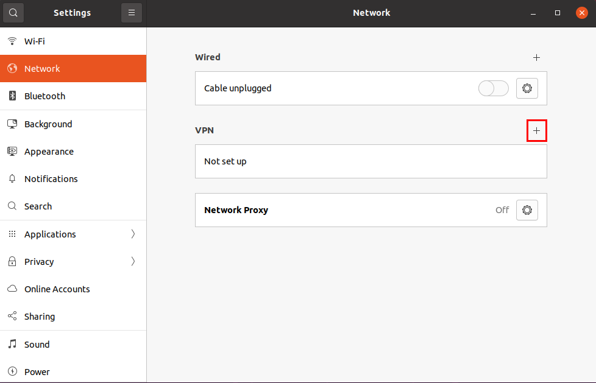

# Bridge VPN on pi 4

* [Set up the bridge VPN](#set-up-the-bridge-vpn)
    * [Authentication Setup with Easy-RSA](#authentication-setup-with-easy-rsa)
    * [VPN setup](#vpn-setup)
* [Basic testing](#basic-testing)
* [Open up the 1194 port on your router](#open-up-the-1194-port-on-your-router-1)
* [Set up the VPN Client](#set-up-the-vpn-client)

## Set up the bridge VPN
We noticed that easy-rsa on raspbian stretch 9 didn't work exactly with the commands that we are giving here, we made the installation with raspberry OS (raspbian) 10 buster, make sure you have the correct version by running `cat /etc/os-release`.
The solution is inspired from [this thread](https://github.com/pivpn/pivpn/issues/45) that gives a solution to build a bridge mode that is not yet supported by piVPN, especially the second message gives a [link](https://www.emaculation.com/doku.php/bridged_openvpn_server_setup) and some guidelines. As the instructions are made for a Linux virtual machine, we will adapt them here to make it easier for you.
If yu ssh on the pi this will be much easier as you'll be able to juste copy and paste the commands from your computer and this will reduce the possible errors that you can make, in a similar manner you can simply open this page on the rapsberry to run the commands more easily.

### Authentication Setup with Easy-RSA
Open Terminal on the raspberry, and become root:
* `sudo su`

You should always become root before running the commands below. Install OpenVPN, Easy-RSA and the Linux Ethernet bridge utilities:

* `apt-get install openvpn easy-rsa bridge-utils`

Copy Easy-RSA to OpenVPN's directory:

* `cp -r /usr/share/easy-rsa /etc/openvpn`

Now we'll make the credentials (certificates and keys) for OpenVPN authentication. Go to Easy-RSA's directory:

* `cd /etc/openvpn/easy-rsa`

Enter

* `./easyrsa init-pki`

Create a Certificate Authority (CA) by entering

* `./easyrsa build-ca nopass`

For Common Name, enter OpenVPN-CA (without quotes).

Create the server credentials by entering

* `./easyrsa gen-req openvpnserver nopass`

The Common Name will be set to openvpnserver by default, so no entry is required.

Sign the server credentials by entering

* `./easyrsa sign-req server openvpnserver`

Enter yes (without quotes) as requested.

Generate Diffie-Hellman parameters by entering

* `./easyrsa gen-dh`

Now we'll create the client credentials.

To create credentials for a client called ps_remote, enter

* `./easyrsa gen-req ps_remote nopass` or `./easyrsa gen-req ps_remote` if you want a password on the VPN access

The Common Name will be set to ps_remote by default, so no entry is required.

Sign the credentials of client ps_remote by entering

* `./easyrsa sign-req client ps_remote`

Enter yes (without quotes) as requested.

You can make more client credentials by changing ps_remote in the previous two commands. 
Each client's Common Name must be unique. 

Create the HMAC signature:

* `openvpn --genkey --secret /etc/openvpn/easy-rsa/pki/private/ta.key`

Certificate and key files will be given to the clients. Copy these files to the host OS via the shared folder by entering

* `mkdir /home/pi/credentials`

* `cp /etc/openvpn/easy-rsa/pki/ca.crt /etc/openvpn/easy-rsa/pki/private/ta.key /etc/openvpn/easy-rsa/pki/issued/ps_remote.crt /etc/openvpn/easy-rsa/pki/private/ps_remote.key /home/pi/credentials`

Change the owner of the certificates to be able to copy them to another machine
* `chown pi /home/pi/credentials/*`

Plug a USB drive onto the pi to get the files

**You have to give the folder credentials that we just created to the computer that is on the remote network in a secure manner: not by email. THe ssafest mannef is by simply giving the USB drive with the certificates** 

### VPN setup
This is where we will be using all the information that we made you find in the part common to both simple and complex installation, namely **raspberry IP**, **netmask**, **broadcast IP**,**router IP**,**public IP**

We'll use the text editor nano to create a script called openvpn-bridge that performs the Ethernet bridging. Enter on the raspberry, still as root: 
* `nano /etc/openvpn/openvpn-bridge`


 Copy and paste the following script into that (empty) file, make sure that you are changing the keyword raspberry IP, broadcast IP and router IP by their values (they are only at the beginning of the script), make sure you leave the quotation mark around them. If you are not used to nano: once you paste the content of the file, ctrl+O for saving and ctrl + X for quitting.
 ```shell
#!/bin/sh

# Define Bridge Interface
br="br0"

# Define list of TAP interfaces to be bridged,
# for example tap="tap0 tap1 tap2".
tap="tap0"

# Define physical ethernet interface to be bridged
# with TAP interface(s) above.
eth="eth0"
eth_ip_netmask="raspberry_IP/24"
eth_broadcast="broadcast_IP"
eth_gateway="router_IP"

case "$1" in
start)
    for t in $tap; do
        openvpn --mktun --dev $t
    done

    brctl addbr $br
    brctl addif $br $eth

    for t in $tap; do
        brctl addif $br $t
    done

    for t in $tap; do
        ip addr flush dev $t
        ip link set $t promisc on up
    done

    ip addr flush dev $eth
    ip link set $eth promisc on up

    ip addr add $eth_ip_netmask broadcast $eth_broadcast dev $br
    ip link set $br up

    ip route add default via $eth_gateway
    ;;
stop)
    ip link set $br down
    brctl delbr $br

    for t in $tap; do
        openvpn --rmtun --dev $t
    done

    ip link set $eth promisc off up
    ip addr add $eth_ip_netmask broadcast $eth_broadcast dev $eth

    ip route add default via $eth_gateway
    ;;
*)
    echo "Usage:  openvpn-bridge {start|stop}"
    exit 1
    ;;
esac
exit 0
 ```
This script is adapted from the bridge-start and bridge-stop scripts at OpenVPN's Ethernet bridging page. It bridges the Ethernet interface, eth0, and OpenVPN's TAP interface, tap0, as members of the bridge interface, br0.

Make the script executable by entering
 * `chmod 744 /etc/openvpn/openvpn-bridge`
 
Now we'll create the server configuration file. Enter
* `nano /etc/openvpn/server.conf`

Copy and paste the following text, you have to modify the line server bridge with your raspberry IP, your netmask and a start IP and end IP, we haven't talked about the start IP and end IP this will be the range of IP that will be allocated to the devices connected to your VPN, if you are only planning to have under 10 devices  you can set a range of 10. for instance if your raspberry IP is `192.168.1.10` you want to assign maximum 10 devices then a start IP could be `192.168.1.100` and an end IP for 10 devices is `192.168.1.109`

```
port 1194
proto udp
dev tap0
ca /etc/openvpn/easy-rsa/pki/ca.crt
cert /etc/openvpn/easy-rsa/pki/issued/openvpnserver.crt
key /etc/openvpn/easy-rsa/pki/private/openvpnserver.key
dh /etc/openvpn/easy-rsa/pki/dh.pem
remote-cert-tls client
server-bridge raspberry_IP netmask start_IP end_IP
client-to-client
keepalive 10 120
tls-auth /etc/openvpn/easy-rsa/pki/private/ta.key 0
cipher AES-256-GCM
compress lz4-v2
push "compress lz4-v2"
push "redirect-gateway def1"
push "dhcp-option DNS 8.8.8.8"
persist-key
persist-tun
status /var/log/openvpn-status.log
log-append /var/log/openvpn.log
verb 3
```
We need to tell OpenVPN to make use of our openvpn-bridge script. Enter

* `nano /lib/systemd/system/openvpn@.service`

Copy these two lines:
```
ExecStartPre=/etc/openvpn/openvpn-bridge start
ExecStopPost=/etc/openvpn/openvpn-bridge stop
```
And paste them at the bottom of the [Service] section.
Exit and save. Reboot the raspberry by entering

* `reboot`

The OpenVPN server will be running at boot, i.e., no user login is required.

### Basic testing
Verify that the br0 and tap0 interfaces are up by entering in Terminal
* `ip a`

Check the OpenVPN server status by entering
* `systemctl status openvpn@server.service`

you should see a display saying that the VPN is running

You still need to enable IP forwarding on your raspberry pi, but if you use the command line to just enable it  (run `echo 1 > /proc/sys/net/ipv4/ip_forward`)but when the next boot comes the IP forwarding will be disabled, you need to edit the boot configuration file of the raspberry:

* `sudo nano /etc/sysctl.conf`

And you have to uncomment the following lines (close from the begin of the file, or just paste it if you are lazy):

* `net.ipv4.ip_forward = 1`


## Open up the 1194 port on your router
**Before performing this last step I recommend disabling SSH on the raspberry pi just to be safe not to have any intrusion on your raspberry, if you are confident in your password and refuse to disable SSH, do the following at your own risks.** if you didn't enable ssh it is deactivated by default. You can configure this just like we presented it in [the first steps](#first-steps-that-are-common-to-all-the-solutions)
Connect to your router admin interface: http://**router IP** and look in the advanced configurations or firewall settings for a port forwarding option (the specific location of this option is dependent of your router) and add a new routing rule:
* protocol: UDP and TCP
* port 1194
* destination: **Raspberry IP**
* external IP: Leave empty except if you only want to authorize some specific IPs to connect to your VPN.

## Set up the VPN Client
On the remote computer, you will need the credendentials files that [you created during the installation of the openVPN server](#authentication-setup-with-easy-rsa).
You will also need a configuration file called `ps_remote.conf` which content has to be customized with the **public IP** line 4 (don't erase 1194 it indicates the port the VPN is using, no quoting marks around the IP). Here is the content:
```
client
dev tap0
proto udp
remote public_IP 1194
persist-key
persist-tun
ca ca.crt
cert ps_remote.crt
key ps_remote.key
remote-cert-tls server
tls-auth ta.key 1
cipher AES-256-GCM
compress lz4-v2
verb 3
```
So as a reminder you need 4 files: `ps_remote.conf` that you just created and `ca.crt` `ps_remote.crt` `ps_remote.key` that were created during the installation of openvpn and the creation of the access to the ps_remote user. They will all be useful for configuring the VPN Client.

Unfortunately, OpenVPN client doesn't support bridging. Therefore we cannot have this client with it's fancy GUI. All the following steps are provided once again by this amazing [guide/blog](https://www.emaculation.com/doku.php/bridged_openvpn_server_setup). Do the following on the computer you wish to use for remote play:

### Windows
* Download [Securepoint SSL VPN Client](https://sourceforge.net/projects/securepoint/) and install it. be sure to select "Management" in the starting context.
* Start Securepoint. In the Taskbar, appeared a little padlock, click on it and in the small GUI that pop up, select the small gear (bottom right) 
* Select **New**, and give a name to your connection. 
* Enter the **public IP** address of the server, keep the default protocol (UDP) and port (1194), and click Add and Next.
* For your client (ps_remote for us), point "Root CA" to ca.crt, "Certificate" to ps_remote.crt, and "Key" to ps_remote.key. 
* Leave "Server certificate" unchecked.
* Click Next, Next and Finish
* Copy ta.key to the folder with the VPN connection's name, found in the user's "AppData\Roaming\Securepoint SSL VPN\config" folder.
* Check that the three previously given files are present in the folder
* Open ps_remote.conf file with a standard text editor and copy the content.
* In Securepoint, right-click on the VPN connection's name, select "Quick edit", delete everything, and paste
* Start the connection

Two options are available: either you are connected and proceed to self-congratulating in whatever form you need, or the icon is red, and ... take a break and restart from the beginning: it took us two days to successfully connect, we know it can be a tough task guys.

### Mac
For Mac unfortunately, we cannot give feedback yet, so I will just paste the [guide](https://www.emaculation.com/doku.php/bridged_openvpn_server_setup) and adapt with names we chose here:
* For macOS clients, use [Tunnelblick](https://tunnelblick.net/). Be sure to get the correct version for your version of macOS, which could be the beta release. When it asks for configuration files after you install it, just quit. 
* Tunnelblick uses files with a ".tblk" extension. For the client "ps_remote", place the files ca.crt, ps_remote.crt, ps_remote.key, ta.key and ps_remote.conf into a new folder called whatever you want to call that VPN connection, say, "Home VPN.tblk".
* Double-click that file to add it to Tunnelblick's list of connections.
* Tunnelblick appears at the right side of the menu bar as a tunnel icon.
* Go to "VPN Details", select the connection on the left, and under the "Settings" tab, set "Set DNS/WINS" to "Do not set nameserver".
* Also uncheck "Check if the apparent public IP address changed after connecting," since this is unnecessary for this type of VPN setup (the client's public IP address will not change).
* Exit the menus. With the OpenVPN server running, click the tunnel icon, and connect. A message about the DNS server address not being routed through the VPN may pop up, which can be ignored since this isn't the intent of this VPN setup.

To get back to the individual client files, right-click on the .tblk file and select "Show Package Contents." If you want to change any of the client files, you must reload (double-click) the .tblk file again after making the changes. However, to quickly change the client configuration file without having to reload, go to "VPN Details", highlight the connection in the list on the left, click the gear icon below the list and select "Edit OpenVPN Configuration File".
The client doesn't need to keep the original client files after the configuration is created, since they get copied to the folder \~/Library/Application Support/Tunnelblick/Configurations.

### Ubuntu
Ubuntu 20.04 integrates Openvpn therefore only two steps are needed: 
* Edit the `ps_remote.conf` file by adding the following two lines at the bottom
```
up /etc/openvpn/update-resolv-conf
down /etc/openvpn/update-resolv-conf
```
* Import the `ps_remote.conf` file in Settings => Network => VPN => + => import from file...
* All files are attributed just like in Securepoint SSL VPN Client in Windows but automatically
* Clic on " Add" on the top right of the window
* Launch the VPN

<p align="center">
 
</p>


Now that you managed to connect you can breathe, this is it, it's done. (Painkiller might be needed)